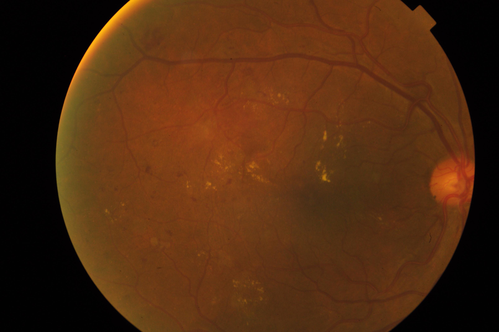

# 👁️ ANEYE

> **Retinal AI Research Platform for Explainable Ophthalmic Screening**

ANEYE is a modular retinal-AI research platform built around fundus-image analysis, explainability, anatomical reasoning, and selective referral.

Its dedicated diabetic-retinopathy module, **NetraAI**, combines image-quality triage, global ICDR grading, lesion evidence, structural retinal analysis, explainability, and a trust-oriented decision layer.

---

## NetraAI — Explainable Diabetic Retinopathy Screening

> **Can the model not only predict retinal disease severity, but also show whether the prediction is trustworthy?**

### Real fundus example used in the development pipeline

  

APTOS 2019 development/demo image used in the NetraAI pipeline.

## End-to-End Pipeline
Quality Gate → Global DR Grading → Lesion Evidence → Structural Retina → Grad-CAM → TRACE-DR → Referral Decision

## APTOS Validation
Accuracy: 83.77%
Macro F1: 70.32%
QWK: 0.9097
RDR Sensitivity: 95.97%
RDR Specificity: 93.33%
AUC: 0.9842

## IDRiD Lesion Segmentation
Macro Dice: 0.5699
MA: 0.5205
HE: 0.4635
EX: 0.7315
SE: 0.5641

## Structural Retina Analysis
Optic disc localization
Estimated foveal landmark
Vessel segmentation
Prototype vessel coverage

## TRACE-DR
T — Triage quality
R — Retain evidence
A — Align clinically
C — Check confidence
E — Escalate

## Example Grade-2 Result
Moderate NPDR
Grade confidence: 86.58%
RDR probability: 99.27%
MA: 26
HE: 9
EX: 90
P-score: 76.6
Concordance: 90.1
T-score: 76.2
Action: REFER_OPHTHALMOLOGY — HIGH

## Datasets
APTOS 2019
IDRiD
ODIR-5K

## Tech Stack
Python
PyTorch
OpenCV
FastAPI
React
Vite

## Disclaimer
Academic/research use only. Not a medical device or autonomous diagnostic system.

1. Image Quality Triage

NetraAI evaluates retinal image quality before disease classification.

The quality engine checks:

Focus
Illumination
Retinal field of view
Contrast
Gradeability

Ungradeable images are flagged for recapture instead of being silently classified as normal.

2. Global Diabetic Retinopathy Grading

The global branch uses EfficientNet-B0 trained on APTOS 2019 fundus images for 5-class ICDR severity grading.

APTOS Validation Results
Metric	Result
Accuracy	83.77%
Macro F1	70.32%
Quadratic Weighted Kappa	0.9097
Referable DR Sensitivity	95.97%
Referable DR Specificity	93.33%
Referable DR AUC	0.9842

These are dataset-validation results, not clinical-validation results.

3. Lesion Segmentation

A dedicated retinal lesion branch trained using IDRiD analyzes:

MA — Microaneurysms
HE — Hemorrhages
EX — Hard Exudates
SE — Soft Exudates
IDRiD Validation
Lesion	Dice
Microaneurysms	0.5205
Hemorrhages	0.4635
Hard Exudates	0.7315
Soft Exudates	0.5641
Macro Dice	0.5699

Dice is reported as a segmentation metric and is not classification accuracy.

4. Structural Retina Analysis

NetraAI includes a prototype structural retinal-analysis layer that performs:

Optic-disc localization
Estimated foveal landmark calculation
Retinal vessel segmentation
Vessel coverage analysis
Retinal field-of-view analysis

The current implementation combines classical image-processing methods with the learned DR pipeline.

The foveal landmark is anatomically estimated rather than independently detected by a trained model. Vessel coverage is currently a prototype engineering measurement rather than a clinically validated biomarker.

5. Explainability

NetraAI combines model attribution with retinal evidence.

MODEL CONFIDENCE
        +
IMAGE RELIABILITY
        +
LESION / ANATOMICAL EVIDENCE
        |
        v
CONCORDANCE
        |
        v
TRUST / SELECTIVE REFERRAL

Grad-CAM attribution is used to inspect which retinal regions contribute to the global severity prediction.

TRACE-DR

TRACE-DR is NetraAI's explainability and reliability framework.

Stage	Function
T	Triage image quality
R	Retain retinal evidence
A	Align prediction with clinical evidence
C	Check confidence and consistency
E	Escalate uncertain or referable cases

Instead of exposing only a disease label, TRACE-DR attempts to make the model's reasoning pathway inspectable.

MODEL Reliability Scores
P-score

Prototype lesion-evidence score:

30% Microaneurysm evidence
30% Hemorrhage evidence
25% Hard Exudate evidence
15% Soft Exudate evidence
T-score

MODEL trust score:

25% Image reliability
25% Model confidence
30% Concordance
15% XAI integrity
5% Stability component

Interpretation:

Score	Band
80+	HIGH
60–79.9	MODERATE
<60	LOW

P-score and T-score are project-specific engineering indices, not established clinical scores.

Example Integrated Analysis

For the Grade-2 fundus example shown above:

Output	Result
Ground Truth	Grade 2
Prediction	Grade 2 — Moderate NPDR
Grade Confidence	86.58%
Referable DR Probability	99.27%
Image Quality	GRADEABLE
Microaneurysms	26
Hemorrhages	9
Hard Exudates	90
Soft Exudates	0
Prototype P-score	76.6
Concordance	90.1 — HIGH
XAI Integrity	50.9
Attribution inside retinal FOV	90.1%
Prototype T-score	76.2 — MODERATE
Decision	REFER_OPHTHALMOLOGY — HIGH
Broader ANEYE Platform

ANEYE also supports broader retinal-disease research through the ODIR-5K dataset.

The dataset pipeline contains 6,392 validated retinal images across eight classes:

Normal
Diabetic Retinopathy
Cataract
Glaucoma
Age-related Macular Degeneration
Hypertensive Retinopathy
Myopia
Other Retinal Diseases
Datasets
Dataset	Role
APTOS 2019	Global DR severity grading
IDRiD	Retinal lesion segmentation
ODIR-5K	Multi-disease retinal research

Additional retinal datasets remain part of future research and are not presented as already-trained production components.

Technology Stack
AI / Computer Vision
Python 3.11+
PyTorch
TorchVision
OpenCV
NumPy
Pandas
scikit-learn
Backend
FastAPI
Uvicorn
Frontend
React
Vite
Framer Motion
GSAP
Three.js
React Three Fiber
Repository Structure
ANEYE/
|
+-- ai/
|
+-- backend/
|   +-- sih_api/
|
+-- frontendnetraai-demo/
|   +-- public/
|       +-- demo/
|           +-- grade0.png
|           +-- grade1.png
|           +-- grade2.png
|
+-- scripts/
|
+-- sih_dr/
|   +-- engine/
|   +-- grading/
|   +-- lesions/
|   +-- quality/
|   +-- structure/
|
+-- docs/
|
+-- README.md
Running NetraAI Locally
Backend
python -m uvicorn backend.sih_api.main:app --host 127.0.0.1 --port 8000

Health endpoint:

GET http://127.0.0.1:8000/api/health

Analysis endpoint:

POST http://127.0.0.1:8000/api/analyze
Frontend
cd frontendnetraai-demo
npm install
npm run dev

Default local frontend:

http://127.0.0.1:5173
Model Checkpoints

Local trained-model paths include:

checkpoints/sih_dr/grading/global_final.pth
checkpoints/sih_dr/lesions/lesion_final.pth

Model weights, raw datasets, generated artifacts, and experiment outputs are intentionally excluded from Git tracking.

Current Research Boundaries

ANEYE / NetraAI is currently an academic engineering research platform.

Current limitations include:

Independent neovascularization detection is not yet implemented
Model confidence has not yet undergone formal calibration
Structural localization is prototype-level
The foveal position is anatomically estimated
Vessel coverage is not a validated clinical biomarker
P-score and T-score are project-specific prototype indices
DME diagnosis is not claimed from color fundus imaging alone
No autonomous diagnostic capability is claimed
No regulatory approval is claimed
Roadmap

Planned research directions include:

Independent neovascularization detection
Formal probability calibration
Stronger anatomical segmentation
Multimodal fundus + OCT analysis
Improved lesion-aware XAI
Foundation-model experimentation including RETFound
External dataset validation
Clinician-in-the-loop evaluation
Anatomical graph modeling
Multi-task retinal reasoning
Disclaimer

ANEYE and NetraAI are academic and research projects intended for educational and experimental use.

They are not medical devices, are not clinically validated diagnostic systems, and should not be used for autonomous diagnosis or treatment decisions.

License

MIT License