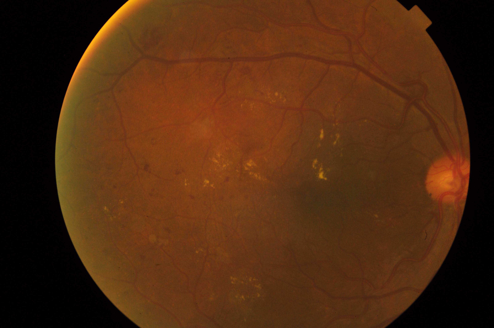
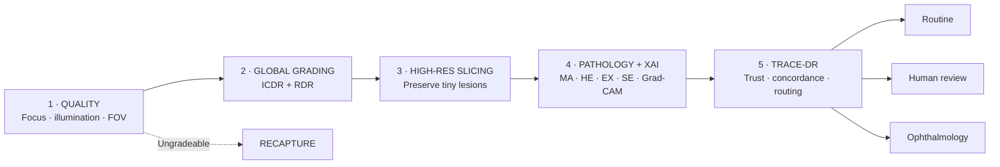
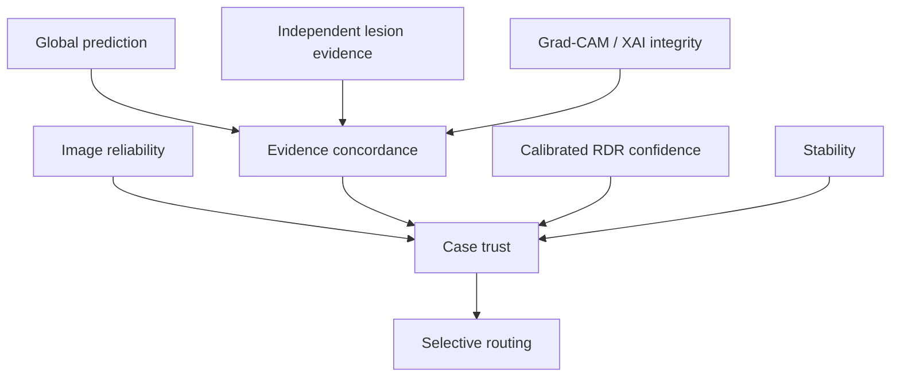
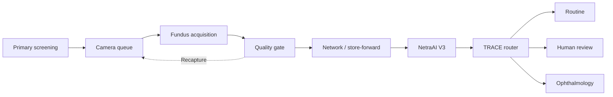
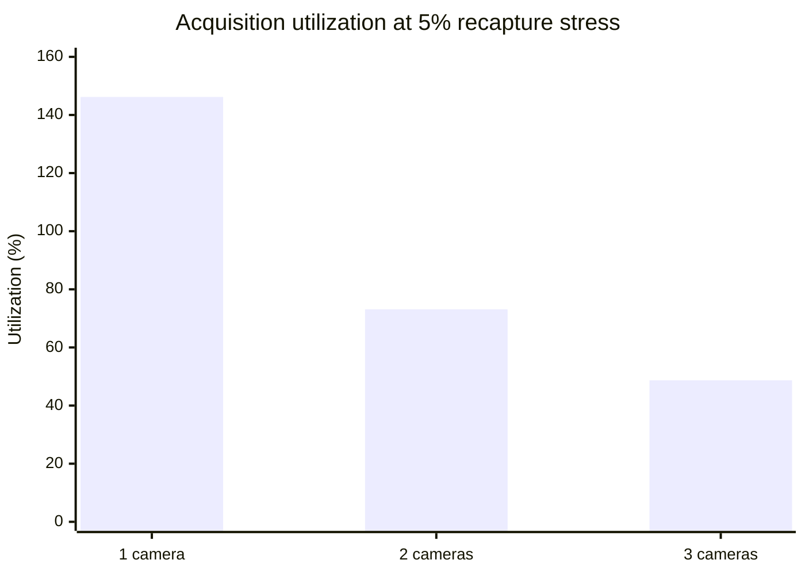
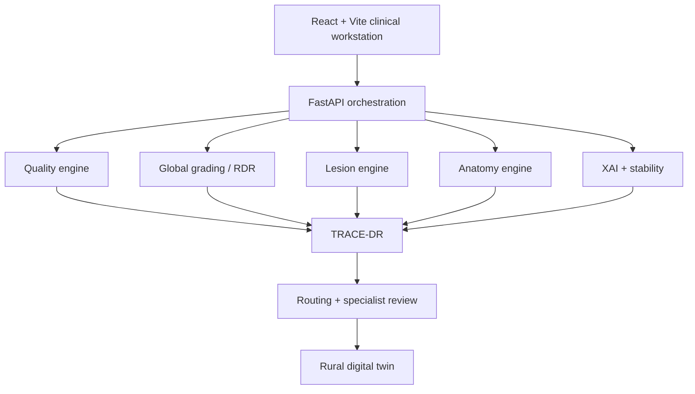

# 👁️ ANEYE × NetraAI

<p align="center">
  <strong>Retinal AI research → explainable diabetic-retinopathy screening → rural deployment intelligence</strong>
</p>

<p align="center">
  <a href="https://netraai-two.vercel.app"></a>
  <a href="https://youtu.be/jr4Tkohdplc"></a>
  
  
</p>

<p align="center">
  
  
  
  
  
  
</p>

---

# 01 · ANEYE

**ANEYE** is the broader retinal-AI research platform behind our work on fundus-image understanding, anatomical reasoning, explainability and selective referral. It provides the reusable engineering foundation on which the dedicated **NetraAI** diabetic-retinopathy workflow is built.

### Research scope

- Multi-disease retinal-image research with **ODIR-5K**
- Fundus preprocessing and image-quality analysis
- Retinal anatomy and vessel-analysis prototypes
- Explainability and evidence visualization
- Reusable FastAPI + React clinical-workstation architecture
- Experimentation layer for future multimodal retinal reasoning

### ANEYE research data

| Dataset | Current role |
|---|---|
| **ODIR-5K** | Broader multi-disease retinal research |
| **APTOS 2019** | Global diabetic-retinopathy grading |
| **IDRiD** | Lesion-level retinal evidence |
| **Additional retinal datasets** | Research / future external-domain work |

> ANEYE is the research platform. **NetraAI is the focused, end-to-end DR screening system developed for SIH 2026.**

---

# 02 · NetraAI

## Explainable Diabetic Retinopathy Screening for Rural India

> **A prediction is not enough. NetraAI asks whether the image is usable, what pathology supports the prediction, whether the evidence agrees, how trustworthy the case is, where the patient should go, and whether a rural district can support that workflow at scale.**

<p align="center">
  
</p>

<p align="center"><sub>Representative Grade-2 fundus case used in the development/demo pipeline.</sub></p>

### The complete pathway

```text
Fundus acquisition
      ↓
Fail-closed Quality Gate ── ungradeable ──→ RECAPTURE
      ↓ gradeable / recovered
Global ICDR Grading + Referable-DR Head
      ↓
High-resolution Lesion Evidence
      ↓
Grad-CAM + Retinal Anatomy + Evidence Integrity
      ↓
TRACE-DR: quality • evidence • alignment • calibration • escalation
      ↓
ROUTINE  /  HUMAN REVIEW  /  OPHTHALMOLOGY REFERRAL
      ↓
Rural Digital Twin → camera • bandwidth • recapture • reviewer capacity
```

---

## Why NetraAI is different

| Conventional screening AI | NetraAI |
|---|---|
| Image → prediction | Image → quality → evidence → trust → route |
| Poor images may reach inference | **Fail-closed quality gate** |
| Whole-image classification only | **Global + high-resolution local analysis** |
| Heatmap presented as explanation | **Grad-CAM + lesions + anatomy + integrity checks** |
| Confidence treated as trust | **Calibration + concordance + stability + trust index** |
| Always returns a class | **Explicit defer / human-review state** |
| AI benchmark ends the story | **SimEvents rural-capacity digital twin** |

---

## Five-stage screening engine


```mermaid
flowchart LR
    A["1 · QUALITY<br/>Focus · illumination · FOV"] --> B["2 · GLOBAL GRADING<br/>ICDR + RDR"]
    B --> C["3 · HIGH-RES SLICING<br/>Preserve tiny lesions"]
    C --> D["4 · PATHOLOGY + XAI<br/>MA · HE · EX · SE · Grad-CAM"]
    D --> E["5 · TRACE-DR<br/>Trust · concordance · routing"]
    A -. "Ungradeable" .-> R["RECAPTURE"]
    E --> O["Routine"]
    E --> H["Human review"]
    E --> P["Ophthalmology"]
```

### 1 — Fail-closed quality gate

The screening engine checks **focus, illumination, contrast and retinal field-of-view before disease inference**.

- **GRADEABLE** → continue
- **BORDERLINE** → denoise + CLAHE luminance enhancement + illumination normalization → reassess
- **UNGRADEABLE** → block downstream ICDR/lesion analysis and request recapture

A controlled recoverable stress-test improved quality score from **45.4 → 75.8** and focus from **20.5 → 79.5** after enhancement.

### 2 — Global DR grading

The global branch performs 5-class ICDR grading and a dedicated referable-DR decision.

| Benchmark metric | Result |
|---|---:|
| Accuracy | **83.77%** |
| Macro F1 | **70.32%** |
| Quadratic Weighted Kappa | **0.9097** |
| RDR Sensitivity | **95.97%** |
| RDR Specificity | **93.33%** |
| RDR AUC | **0.9842** |

> These are **dataset-validation / engineering results**, not prospective clinical-validation results.

### 3 — High-resolution pathology evidence

The local branch preserves small retinal features and analyzes:

**MA** Microaneurysms · **HE** Hemorrhages · **EX** Hard Exudates · **SE** Soft Exudates

| IDRiD segmentation metric | Dice |
|---|---:|
| Microaneurysms | 0.5205 |
| Hemorrhages | 0.4635 |
| Hard Exudates | 0.7315 |
| Soft Exudates | 0.5641 |
| **Macro Dice** | **0.5699** |

### 4 — Explainability beyond a heatmap

NetraAI deliberately does **not** treat Grad-CAM as pathology proof. The explanation layer combines:

- Grad-CAM attribution
- independently segmented lesion evidence
- attribution inside the retinal FOV
- lesion overlap / XAI integrity
- optic-disc, foveal and vessel context
- evidence-to-prediction concordance
- benign-transform stability


```mermaid
flowchart TD
    G["Global prediction"] --> C["Evidence concordance"]
    L["Independent lesion evidence"] --> C
    X["Grad-CAM / XAI integrity"] --> C
    Q["Image reliability"] --> T["Case trust"]
    C --> T
    K["Calibrated RDR confidence"] --> T
    S["Stability"] --> T
    T --> R["Selective routing"]
```

---

## TRACE-DR — the explainability contract

**TRACE-DR** turns explainability from a final heatmap into an inspectable, gated workflow.

| Stage | Meaning | What it enforces |
|---|---|---|
| **T** | **Triage quality** | No trusted prediction without reliable acquisition |
| **R** | **Retain evidence** | Preserve whole-retina context + high-resolution lesion evidence |
| **A** | **Align clinically** | Compare named retinal evidence with the predicted severity |
| **C** | **Calibrate** | Separate probability from confidence; expose stability/integrity |
| **E** | **Escalate** | Make disagreement operational through defer/review/referral |

TRACE-DR therefore asks not only **“where did the model look?”**, but **“what evidence supports the decision, does that evidence agree, and is the system willing to act?”**

---

## Real V3 integrated case

**Case:** Grade 2 — Moderate NPDR

| Output | Real V3 result |
|---|---:|
| Image quality | **GRADEABLE · 61.7/100** |
| Calibrated RDR probability | **98.2%** |
| Microaneurysms | **26** |
| Hemorrhages | **9** |
| Hard Exudates | **90** |
| Soft Exudates | **0** |
| P-Score V2 | **76.6 · MODERATE** |
| Evidence Concordance V3 | **90.1 · HIGH** |
| XAI integrity | **50.9** |
| Stability V1 | **99.7 · HIGH** |
| T-Score V2 | **79.6 · MODERATE** |
| Final route | **REFER_OPHTHALMOLOGY** |
| Priority | **HIGH** |
| End-to-end runtime | **~9.61 s** |

**P-Score** is a prototype pathology-evidence index. **T-Score** combines image reliability, calibrated confidence, concordance, XAI integrity and stability. Neither is presented as a clinical biomarker or diagnostic probability.

---

## Rural deployment digital twin

The clinical pathway answers **where should the patient go?** The digital twin asks **can the district actually get them there?**


```mermaid
flowchart LR
    P["Primary screening"] --> CQ["Camera queue"]
    CQ --> C["Fundus acquisition"]
    C --> Q["Quality gate"]
    Q -. "Recapture" .-> CQ
    Q --> N["Network / store-forward"]
    N --> AI["NetraAI V3"]
    AI --> TR["TRACE router"]
    TR --> RT["Routine"]
    TR --> HR["Human review"]
    TR --> OP["Ophthalmology"]
```

Built in **MATLAB R2026a + Simulink + SimEvents**, the engineering digital twin models a **100,000 screenings/year** target.

### Baseline deployment contract

| Parameter | Baseline |
|---|---:|
| Annual target | **100,000 screenings/year** |
| Primary demand | **41.7 cases/hour** |
| Interarrival | **86.4 s** |
| Camera pool | **2 stations** |
| Bandwidth | **10 Mbps** |
| Recapture stress assumption | **5%** |
| Camera utilization | **73.10%** |
| Network utilization | **4.69%** |
| AI utilization | **3.92%** |
| Baseline status | **STABLE** |

### Why two cameras?


```mermaid
xychart-beta
    title "Acquisition utilization at 5% recapture stress"
    x-axis ["1 camera", "2 cameras", "3 cameras"]
    y-axis "Utilization (%)" 0 --> 160
    bar [146.2, 73.1, 48.7]
```

**1 camera → 146.2%**: cannot sustain target demand  
**2 cameras → 73.1%**: feasible baseline with headroom  
**3 cameras → 48.7%**: additional capacity

### Resource sweep

The SimEvents sweep evaluates:

- **3** camera configurations: 1 / 2 / 3
- **7** bandwidth levels: 0.5 → 50 Mbps
- **7** recapture-stress levels: 0 → 50%
- **147 total deployment scenarios**
- **147/147 simulation executions passed**
- **84/147** met the defined analytical stability criterion

> Recapture percentage is an **engineering sensitivity dimension**, not observed clinical recapture prevalence. The digital twin is for engineering resource sizing, not clinical validation.

---

## Specialist verification & human-in-the-loop routing

The review workspace places the fundus evidence, prediction, pathology, Grad-CAM, trust indicators and TRACE route in one view. A reviewer can:

**Confirm route · Human review · Override · Recapture**

The interface is **designed for <30-second specialist verification**; this is a workflow target, not a claimed clinical-validation endpoint.

---

## Architecture


```mermaid
flowchart TB
    UI["React + Vite clinical workstation"] --> API["FastAPI orchestration"]
    API --> Q["Quality engine"]
    API --> G["Global grading / RDR"]
    API --> L["Lesion engine"]
    API --> A["Anatomy engine"]
    API --> X["XAI + stability"]
    Q --> T["TRACE-DR"]
    G --> T
    L --> T
    A --> T
    X --> T
    T --> R["Routing + specialist review"]
    R --> D["Rural digital twin"]
```

### Technology stack

| Layer | Technologies |
|---|---|
| AI / CV | Python · PyTorch · TorchVision · OpenCV · NumPy · scikit-learn |
| Models | EfficientNet-based grading · lesion segmentation · Grad-CAM |
| Backend | FastAPI · Uvicorn |
| Frontend | React · Vite · Framer Motion · GSAP |
| Deployment modelling | MATLAB · Simulink · SimEvents |
| Web deployment | Vercel frontend · Cloudflare demo tunnel |

---

## Live prototype

### 🌐 [Open NetraAI](https://netraai-two.vercel.app)

### 🎥 [Watch the complete demo](https://youtu.be/jr4Tkohdplc)

The deployed demonstration connects the screening workstation with quality gating, DR grading, pathology evidence, XAI, TRACE-DR and the interactive rural digital-twin view.

---

## Repository structure

```text
ANEYE/
├── ai/
├── backend/
│   └── sih_api/
├── frontendnetraai-demo/
│   └── public/demo/
├── scripts/
├── sih_dr/
│   ├── engine/
│   ├── grading/
│   ├── lesions/
│   ├── quality/
│   └── structure/
├── docs/
└── README.md
```

## Run locally

### Backend

```bash
python -m uvicorn backend.sih_api.main:app --host 127.0.0.1 --port 8000
```

Health: `GET /api/health`  
Analysis: `POST /api/analyze`

### Frontend

```bash
cd frontendnetraai-demo
npm install
npm run dev
```

Default local frontend: `http://127.0.0.1:5173`

---

## Research boundaries

NetraAI is an **academic engineering research prototype and clinical decision-support workflow**, not an autonomous diagnostic system.

- Benchmark results are not prospective clinical validation.
- P-Score and T-Score are project-specific engineering indices.
- Structural localization remains prototype-level.
- Advanced retinal evidence alerts do not independently establish severe NPDR.
- DME diagnosis is not claimed from color fundus imaging alone.
- Human/ophthalmologist interpretation remains the final clinical authority.
- No regulatory approval or medical-device status is claimed.

---

## Roadmap

- External-domain validation
- Stronger anatomical segmentation
- Clinician-in-the-loop evaluation
- Multimodal fundus + OCT research
- Improved lesion-aware explanation fidelity
- Deployment studies under real PHC connectivity and acquisition conditions
- Extended retinal foundation-model experimentation

---

## License

MIT License

<p align="center">
  <strong>ANEYE researches the retina. NetraAI turns that research into an explainable rural DR-screening pathway.</strong>
</p>
